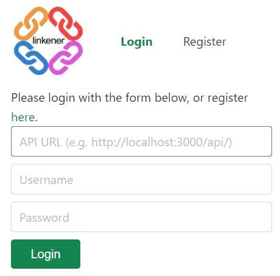

# Linkener

  [](https://github.com/sponsors/shu8/)

<p align='center'>
    
</p>

A fast, lightweight, fully-featured, self-hosted URL shortener written in Go.

## 📕 Background

URL shorteners let you convert long ugly or scary links into short, more memorable links. Self hosting a URL shortener has a few advantages:

- you don't need to worry about a 3rd party service shutting down, rendering all your existing links useless
- you _own_ your data, can export it and query it however you like
- you can brand links with your own domain, or customize the design of pages
- you can give admin access to other trustworthy users really easily
- it's _much_ easier to get new features added and bugs fixed!

## ⭐ Features

Linkener (_Link_ Short*ener*) has a bunch of features:

- 🐳 Easy-install docker images available with minimal configuration required
- 🔒 Password protected short URLs
- 🔢 Maximum visit expiry for short URLs
- 💪 Self hosted -- own your data, brand your links, free forever
- 📈 Visit tracking (currently only the referer's are recorded)
- 💾 Multiple storage backends (currently either a JSON file or SQLite database)
- 👨🏾‍💻 Simple username/password login & registration
- 🌐 Easy to use, minimalistic admin panel (see [linkener-web](https://github.com/shu8/linkener-web))
- 💯 REST API to integrate with other services and generate access tokens for e.g. custom clients
- ⚓ _(coming soon!)_ Webhook support to be notified when a URL is visited

It's written in Go to be extremely lightweight, producing a single executable that can be run basically anywhere (Raspberry Pi, a cheap VPS, your laptop, anywhere!) with minimal resources -- if you don't want the load of a database server for a URL shortener that you're only going to use for a few 10s or 100s of links, you can set Linkener to simply use a JSON file, or SQLite database!

It's also really easy to add new features (see the [Contributing](#Contributing) section later)!

## 📥 Installation

### Docker image

For many cases, using the Docker image (~20MB based on Alpine Linux) will be the easiest and fastest way to setup Linkener.

```bash
docker run -p 3000:3000 shu8/linkener:0.1.0
```

This will start a container running Linkener on port 3000 (you can change this as desired).

If you want to tweak the config (see [Configuration](#Configuration)), just create a `config.json` file and run:

```bash
docker cp config.json linkener:/root/.linkener/config.json
docker restart linkener
```

### Docker compose

If you want to build a container yourself, you can use the included [Docker Compose file](./docker-compose.yml) to spin one up!

```bash
git clone git@github.com:shu8/linkener.git
# Or git clone https://github.com/shu8/linkener.git if using HTTPS
# Make your changes to the docker-compose.yml file or the main code
docker-compose up -d
```

### Building manually

It's also really easy to build the project manually!

```bash
git clone git@github.com:shu8/linkener.git
# Or git clone https://github.com/shu8/linkener.git if using HTTPS
go mod download && go build ./... && go install ./...
linkener
```

## ▶ Usage

Running the `linkener` executable or starting a Docker container/image is enough to get Linkener running (by default, on port 3000).

By default, `linkener` will look for a `~/.linkener/config.json` file on start (this is done for you in the Docker image).

To override the config file location, use the `-c` or `-config` flag, for example:

```bash
linkener -c /some/other/dir/config.json
```

You **must** have a config file, even if it's just `{}` (missing properties mean to use the default values -- see [Configuration](#Configuration)). If a config file can't be found, the program will exit immediately.

### Making an account

Once `linkener` is running, you'll need to make an account first. You can do this quickly via the terminal:

```bash
curl -XPOST -H "Content-type: application/json" -d '{"username":"YOUR_USERNAME", "password":"YOUR_PASSWORD"}' 'http://localhost:3000/api/auth/users'
```

...or use a GUI like the [official Linkener web interface](https://github.com/shu8/linkener-web):

### Using the Linkener web interface

A simple, easy to use web-app is available at [`linkener-web`](https://github.com/shu8/linkener-web), which can be built to a simple static site to be hosted using e.g. nginx. A Docker image/Docker Compose configuration is also available to easily get it running.

The web-app is a Progressive Web App so it can easily be 'installed' on mobile devices, and it lets you connect to any Linkener server with a public API!

<p align='center'>
    
    
</p>

**Check out installation instructions and more details at the [`linkener-web`](https://github.com/shu8/linkener-web) repository!**

### REST API & Redirects

Now, you can use the REST API to interact with Linkener. By default, the API can be found at `/api/` of the root domain. This can be configured with the `api_root` config setting.

Visits to the root will be treated as short URL requests, e.g. a short URL with slug `google` can be accessed by visiting `http://localhost:3000/google`.

If a password is required, the default password screen will appear:

<p align='center'>
    
</p>

**See the REST API docs [here](./API.md).**

## ⚙ Configuration

Linkener uses a JSON file to configure its behaviour. The possible fields, descriptions, and defaults are below. By default, Linkener will look for the config file in `~/.linkener/config.json`. See [Usage](#Usage) for details on how to override this location.

| Field name              | Default                         | Description                                                                                                                                                                                                                                                                              |
| ----------------------- | ------------------------------- | ---------------------------------------------------------------------------------------------------------------------------------------------------------------------------------------------------------------------------------------------------------------------------------------- |
| `store_type`            | `"json"`                        | The store for your short URLs. One of `json`, `sqlite`                                                                                                                                                                                                                                   |
| `port`                  | `3000`                          | The port to run the `linkener` service and API on                                                                                                                                                                                                                                        |
| `auth_db_location`      | `"/var/lib/linkener/auth.db"`   | The location of the SQLite database file that stores your Linkener login credentials and access tokens for the API                                                                                                                                                                       |
| `json_store_location`   | `"/var/lib/linkener/urls.json"` | The location of the JSON file when using a `json` store for your short URLs                                                                                                                                                                                                              |
| `sqlite_store_location` | `"/var/lib/linkener/urls.db"`   | The location of the SQLite database file when using an `sqlite` store for your short URLs                                                                                                                                                                                                |
| `auth_enabled`          | `true`                          | Whether login and access token authorization for the API is required (useful if running locally behind an existing login system). Note if this is `false`, you still need an access token to use the `PUT /users/{username}` endpoint, but no other endpoints will require authorization |
| `registration_enabled`  | `true`                          | Whether registration (`POST /users/`) is enabled or not (useful if the Linkener instance is not meant to be public but is accessible over the Internet for e.g. personal use)                                                                                                            |
| `api_root`              | `"api"`                         | The subpath at which the API should be found, excluding the initial `/`. e.g. `api` means find the API at `/api/` of the root domain                                                                                                                                                     |
| `redirect_root`         | `""`                            | The subpath at which the main Linkener redirect service should run, excluding the initial `/`. e.g. `link` means the redirect service will run at `/link/` of the root domain. This is useful when running Linkener on a subpath of an existing domain                                   |

## ❓ Why?

Why yet another URL shortener?

I wanted to learn [Go](https://golang.org/) and love building projects, so a URL shortener seemed like a good starter project for me to learn lots of things about Go (and Docker!): the HTTP library, managing databases, reading/writing to files, containerizing Go applications, and so much more!

I also wanted to host a URL shortener on my website to be able to brand a few links but couldn't find anything lightweight (to run on a VPS that has lots of other services already running on it!), with all the features I wanted (password protection, easy logging in from anywhere, etc.), and was really easy to install and configure -- so I built one!

## 💡 Inspirations

Linkener is inspired by many other _awesome_ open source URL shorteners. To name just a few: [Shlink](https://shlink.io/), [Polr](https://polrproject.org/), and [YOURLS](https://yourls.org/).

## 👩🏾‍💻 Contributing

I'd love contributions! If you're interested in contributing to Linkener, please fork the repo, add your commits, and [open a pull request](https://github.com/shu8/linkener/compare/) for reviewing!

Feel free to open an issue first if you want to validate or get suggestions on an idea!

I'm going to focus on adding (and learning how to write them in Go) tests for Linkener next, to make it more reliable!

## ℹ Support

Please [open an issue](https://github.com/shu8/linkener/issues/new) for support -- from anywhere like reporting bugs, suggesting new features, or help getting Linkener up and running on your setup! :)

## 🔑 License

&copy; [Shubham Jain](https://sjain.dev) 2020, [MIT License](./LICENSE).
